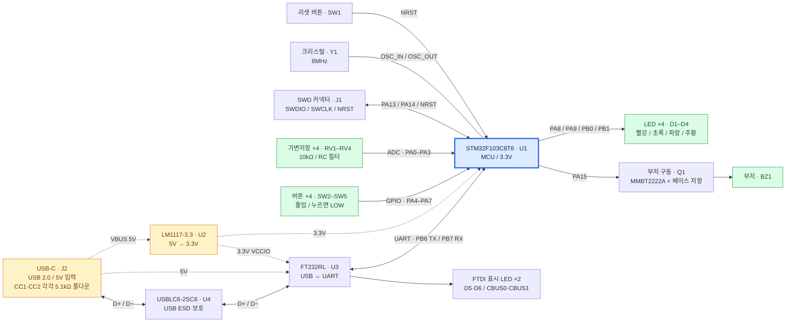

# STM32F103C8T6 테스트 보드

STM32F103C8T6를 중심으로 디지털 입출력, ADC 입력, 부저 제어, USB-UART 통신을 실습하는 보드입니다.

## 블록 다이어그램

현재 저장된 KiCad 회로도를 기준으로 주요 연결을 정리했습니다. 실선은 신호 경로, 점선은 전원 공급을 나타냅니다.

USB-C의 데이터는 **FT232RL을 통한 UART**로 MCU에 전달됩니다. MCU의 USB 핀 PA11·PA12에 직접 연결된 구성은 아닙니다. 3.3V 전원은 MCU 외에도 LED, 버튼 풀업, 가변저항, 부저 및 FT232RL의 VCCIO에 공급됩니다. 도면에서는 가독성을 위해 일부 전원선과 공통 GND를 생략했습니다.

## 주변장치 연결

| 블록 | 부품 | MCU 연결 | 용도 |
|---|---|---|---|
| USB-UART | J2, U4, U3 | PB6(TX), PB7(RX) | PC와 UART 통신 |
| LED 4개 | D1–D4 | PA8, PA9, PB0, PB1 | GPIO 출력, LOW일 때 점등 |
| 버튼 4개 | SW2–SW5 | PA4–PA7 | GPIO 입력, 누르면 LOW |
| 가변저항 4개 | RV1–RV4 | PA0–PA3 | RC 필터를 거친 아날로그 입력 |
| 부저 | Q1, BZ1 | PA15 | 트랜지스터를 통한 부저 구동 |
| SWD | J1 | PA13, PA14, NRST | 펌웨어 다운로드 및 디버깅 |
| 외부 클록 | Y1 | OSC_IN, OSC_OUT | 8MHz 크리스털 |
| 리셋 | SW1 | NRST | MCU 리셋 |
| 전원 | U2 | 3.3V 전원 핀 | USB 5V를 3.3V로 변환 |

## 회로도 파일

- [최상위 회로도 — USB-C, 보호회로, 부저 및 시트 연결](stm32f103c8t6.kicad_sch)
- [MCU, 클록 및 SWD](STM32F103C8_MCU.kicad_sch)
- [3.3V 전원](LM1117.kicad_sch)
- [USB-UART](ftdi.kicad_sch)
- [LED](led.kicad_sch)
- [버튼](button.kicad_sch)
- [가변저항](pot.kicad_sch)

현재 회로도 작성 단계이며, PCB 배치·배선 및 실물 동작 검증은 아직 완료되지 않았습니다.
